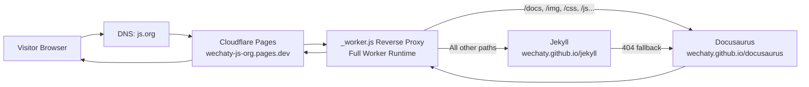
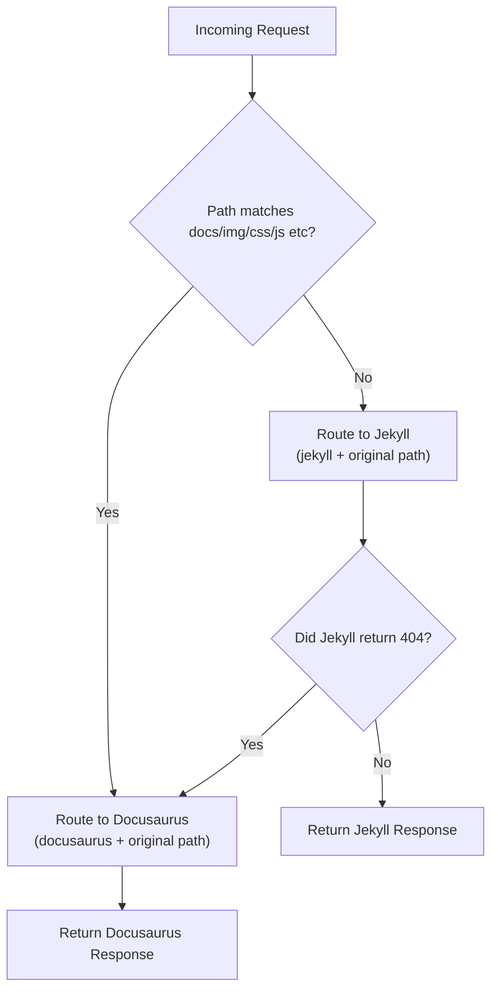
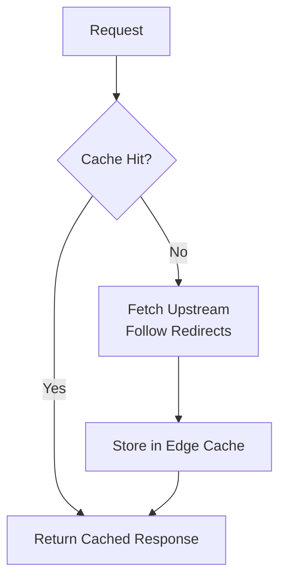

# 🌐 Wechaty.js.org — Cloudflare Pages Transparent Proxy

<div align="center">
<a href="https://wechaty.js.org">
  
</a>
<br/>
<h1>Wechaty Organization Website (Cloudflare Pages Proxy)</h1>
<p>
This repository hosts the <b>Cloudflare Pages</b> implementation of the Wechaty Website Proxy, replacing the legacy Nginx + Docker setup and enabling the JS.org custom domain without requiring DNS control.
</p>
</div>

<p align="center">
<a href="https://github.com/cloudflare/pages-functions">
  
</a>
<a href="https://github.com/wechaty/wechaty.js.org">
  
</a>
<a href="https://github.com/js-org/js.org">
  
</a>
</p>

---

## 🚀 Overview

This repository now uses **Cloudflare Pages + _worker.js** to implement a full reverse-proxy layer that merges two GitHub Pages sites (Jekyll + Docusaurus) into the unified domain **wechaty.js.org**, exactly replicating the original Nginx configuration.

Unlike Pages Functions — which cannot intercept static paths like `/img`, `/css`, `/js`, or `/assets` — the `_worker.js` file provides **full Worker-level request control**, enabling:

* Transparent reverse proxying
* URL rewriting and prefix routing
* Upstream redirect following (301/302/303/307/308)
* Jekyll → Docusaurus fallback
* Static asset interception
* GitHub Pages SSR-like merging of two upstreams

This achieves **100% feature parity** with the original Nginx setup but is now faster, serverless, globally distributed, and fully compatible with JS.org custom domains.

---

## 🏗️ Architecture (Cloudflare Pages + _worker.js)

### 🔥 Why `_worker.js` is Required

Cloudflare Pages processes requests in this order:

1. Static files (`/public`)
2. **_worker.js (FULL Worker control)** ← our proxy runs here
3. Pages Functions (`/functions`)

Pages Functions cannot intercept:

* `/img/*`
* `/css/*`
* `/js/*`
* `/assets/*`
* `/favicon.ico`
* `/manifest.json`
* Any other static-like path

But `_worker.js` intercepts **every** incoming request — making it the correct tool for reverse proxying.

---

### 🌍 Updated System Architecture



### 🔀 Routing Logic Diagram



### ⚡ Edge Caching Behavior



---

## 📁 Project Structure

```
/
├─ functions/
│  └─ [[path]].js     # Cloudflare Pages Function (proxy logic)
├─ public/            # Optionally used for static assets
└─ README.md
```

The core logic lives in `functions/[[path]].js` which intercepts **all** incoming paths.

---

## 🔧 Deployment (Cloudflare Pages + _worker.js)

### 1. Create Cloudflare Pages Project

* Cloudflare Dashboard → **Pages** → *Create Project* → Connect GitHub Repo

### 2. Project Structure

```
/
├─ _worker.js          # Full Worker runtime for proxy logic
├─ public/             # Optional static files
└─ README.md
```

### 3. Deploy

Cloudflare builds automatically.
Deployment URL example:

```
https://wechaty-js-org.pages.dev
```

### 4. Configure JS.org Domain

Open PR at: [https://github.com/js-org/js.org](https://github.com/js-org/js.org)

```json
"wechaty.js.org": "wechaty-js-org.pages.dev"
```

### 5. Local Development Notes

Cloudflare Pages CLI (`wrangler pages dev`) cannot simulate GitHub Pages reverse proxying — it rewrites origin hosts to localhost.

Use instead:

```bash
wrangler dev _worker.js
```

This accurately simulates production Worker behavior.

---

### 1. Create Cloudflare Pages Project

Cloudflare Dashboard → **Pages** → *Create Project* → Connect GitHub Repo.

### 2. Build Settings

* Framework preset: **None**
* Build command: *(empty)*
* Output directory: `./`
* Pages Functions automatically detected in `/functions`

### 3. Deploy

Cloudflare will assign:

```
https://<project>.pages.dev
```

### 4. JS.org Domain Request

Open PR in [https://github.com/js-org/js.org](https://github.com/js-org/js.org):

```json
"wechaty.js.org": "<project>.pages.dev"
```

JS.org maintainers will CNAME `wechaty.js.org` → Cloudflare Pages.

### 5. Set custom domain

run `scripts/custom-domain-4-pages-dev.sh` with your cloudflare account email/id and the global api key.

---

## ⚙️ _worker.js — Cloudflare Worker Behavior

The `_worker.js` file provides:

* Full Worker API inside Cloudflare Pages
* Transparent GitHub Pages reverse proxy
* Prefix-based routing like original Nginx
* 404 fallback (Jekyll → Docusaurus)
* Internal redirect following
* Edge caching
* Universal asset handling (`/img`, `/css`, `/js`, etc.)

### Why not Pages Functions?

Pages Functions do **not** run for static-like paths.
`_worker.js` is necessary to ensure **complete** routing control.

---

The Pages Function implements:

* Docusaurus/Jekyll routing
* 404 fallback
* GitHub Pages redirect handling
* Edge caching
* Transparent proxying

Code is located in `functions/[[path]].js`.

---

## 📚 Historical Notes

### Legacy (2021–2025)

* Nginx + Docker Compose used as a transparent proxy
* Auto TLS with nginx-proxy + ACME companion
* Routing merged two GitHub Pages sites

All original infrastructure has been preserved in:

```
/deprecated/
```

### Migration to Cloudflare Pages (2025)

* Removed all server dependencies
* Adopted globally distributed proxy logic
* Replaced Nginx config with Pages Functions
* Fully decoupled from Cloudflare DNS limitations

---

## 👤 Author

**Huan LI (李卓桓)** — Creator of Wechaty, open-source advocate, cloud-native architect.

GitHub: [https://github.com/huan](https://github.com/huan)
Website: [https://wechaty.js.org](https://wechaty.js.org)

---

## 📄 License

Released under the **Apache-2.0 License**.
