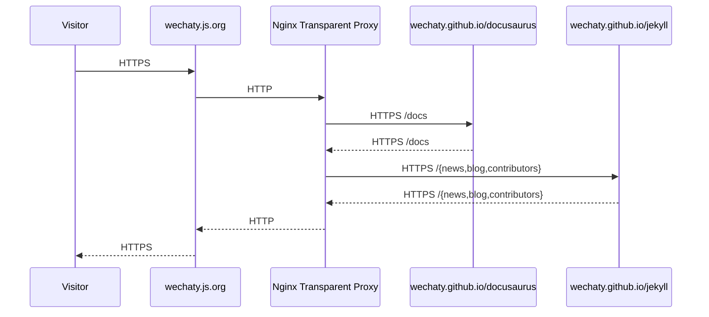

<div align="center">
<a href="https://wechaty.js.org">
  
</a>
<br />
<h1>Wechaty Organization Website</h1>
<p>
Repository for the Wechaty Organization Website, a resource for the Wechaty Organization. It is the official Wechaty website for publishing latest news, blog posts, contributor profiles, and documentation from our open source community.
</p>
<p align="center">
<a href="https://github.com/wechaty/wechaty.js.org" alt="GitHub contributors">
</a>
<a href="https://github.com/wechaty/wechaty.js.org" alt="GitHub issues by-label">
</a>
<a href="https://gitter.im/wechaty/wechaty" alt="Gitter">
</a>
</p>

[](https://github.com/wechaty/docusaurus/actions/workflows/gh-pages.yml)
[](https://github.com/wechaty/jekyll/actions/workflows/gh-pages.yml)

</div>

## 1. News, Blog, Contributor Profiles

[](https://github.com/wechaty/jekyll)

Goto Jekyll Repo: <https://github.com/wechaty/jekyll>

## 2. Documentation

[](https://github.com/wechaty/docusaurus)

Goto Docusaurus Repo: <https://github.com/docusaurus>

# Wechaty Official Website Transparent Proxy

This repo is the configuration for transparent proxy GitHub Pages of Jekyll and Docusaurus for merging them into our <https://wechaty.js.org> home page.

If you want to create blog post, or contribute to documentation, please visit the above repos ([Jekyll](https://github.com/wechaty/jekyll) & [Docusaurus](https://github.com/docusaurus)).

## Usage

```sh
docker-compose up
```

You are all set.

## Architecture

We are using Nginx as the front end proxy for serving the website traffic, from the below two locations:

1. Docusaurus Documentation <https://wechaty.github.io/docusaurus/>
1. Jekyll Posts <https://wechaty.github.io/jekyll/>



This repo is maintaining the [docker-compose.yml](docker-compose.yml) for the **Nginx Transparent Proxy** layer (in the center of the above diagram) of the website.

## Nginx Transparent Proxy Configuration

1. for `/docs` locations, proxy pass to <https://wechaty.github.io/> with a prefix `docusaurus` added to the path.
1. for `/{news,blogs,contributors,\d\d\d\d}` locations, proxy pass to <https://wechaty.github.io/> with a prefix `jekyll` added to the path.

Learn more from [nginx.conf](nginx.conf) and [docker-compose.yml](docker-compose.yml) files.

That's all.

## Nginx Ingress Proxy Configuration

We are using [Automated nginx proxy for Docker containers using docker-gen](https://github.com/nginx-proxy/nginx-proxy) to set up a container running nginx and docker-gen. docker-gen generates reverse proxy configs for nginx and reloads nginx when containers are started and stopped.

See [Automated Nginx Reverse Proxy for Docker, Jason Wilder, Mar 25, 2014](http://jasonwilder.com/blog/2014/03/25/automated-nginx-reverse-proxy-for-docker/) for why we are using this.

Here's an example `docker-compose.yml` configuration for the **Nginx Ingress Proxy** layer:

```yaml
version: '3.8'
services:

  nginx-proxy:
    image: nginxproxy/nginx-proxy
    container_name: nginx-proxy
    network_mode: bridge
    ports:
      - 80:80
      - 443:443
    volumes:
      - conf:/etc/nginx/conf.d
      - vhost:/etc/nginx/vhost.d
      - html:/usr/share/nginx/html
      - dhparam:/etc/nginx/dhparam
      - certs:/etc/nginx/certs:ro
      - /var/run/docker.sock:/tmp/docker.sock:ro
    healthcheck:
      test: ["CMD", "true"]
      interval: 1m30s
      timeout: 10s
      retries: 3
      start_period: 40s

  letsencrypt:
    image: jrcs/letsencrypt-nginx-proxy-companion
    container_name: nginx-proxy-le
    network_mode: bridge
    environment:
      - NGINX_PROXY_CONTAINER=nginx-proxy
      - DEFAULT_EMAIL=wechaty@chatie.io
    volumes:
      - conf:/etc/nginx/conf.d
      - vhost:/etc/nginx/vhost.d
      - html:/usr/share/nginx/html
      - dhparam:/etc/nginx/dhparam
      - certs:/etc/nginx/certs:rw
      - /var/run/docker.sock:/var/run/docker.sock:ro

volumes:
  conf:
  vhost:
  html:
  dhparam:
  certs:
```

## TLS Certificate Authorization (CA) Configuration

We are using [Automated ACME SSL certificate generation for nginx-proxy](https://github.com/nginx-proxy/acme-companion) lightweight companion container for nginx-proxy.

It handles the automated creation, renewal and use of SSL certificates for proxied Docker containers through the ACME protocol.

## Resource

- [Host Multiple Websites On One VPS With Docker And Nginx (with TLS), Joel Hans, Apr 17, 2019](https://blog.ssdnodes.com/blog/host-multiple-websites-docker-nginx/)

## History

### main (Mar 31, 2022)

Split the repo into two: Jekyll & Docusaurus ([Issue #1](https://github.com/wechaty/wechaty.js.org/issues/1))

## Author

[Huan LI](http://linkedin.com/in/zixia) is a serial entrepreneur, active angel investor with strong technology background.
Huan is a widely recognized technical leader on conversational AI and open source cloud architectures.
He co-authored guide books "Chatbot 0 to 1" and "Concise Handbook of TensorFlow 2"
and has been recognized both by Microsoft and Google as MVP/GDE.
Huan is a Chatbot Architect and speaks regularly at technical conferences around the world.
Find out more about his work at <https://github.com/huan>

## Copyright & License

- Docs released under Creative Commons
- Code released under the Apache-2.0 License
- Code & Docs © 2021 Huan LI \<zixia@zixia.net\>
