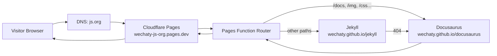
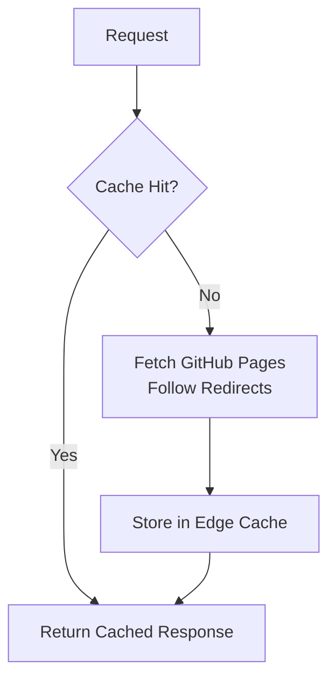

# 🌐 Wechaty.js.org — Cloudflare Pages Transparent Proxy

<div align="center">
<a href="https://wechaty.js.org">
  
</a>
<br/>
<h1>Wechaty Organization Website (Cloudflare Pages Proxy)</h1>
<p>
This repository hosts the <b>Cloudflare Pages</b> implementation of the Wechaty Website Proxy, replacing the legacy Nginx + Docker setup and enabling the JS.org custom domain without requiring DNS control.
</p>
</div>

<p align="center">
<a href="https://github.com/cloudflare/pages-functions">
  
</a>
<a href="https://github.com/wechaty/wechaty.js.org">
  
</a>
<a href="https://github.com/js-org/js.org">
  
</a>
</p>

---

## 🚀 Overview

The Wechaty website consists of two GitHub Pages projects:

* **Docusaurus Documentation:** [https://wechaty.github.io/docusaurus/](https://wechaty.github.io/docusaurus/)
* **Jekyll Blog & Community:** [https://wechaty.github.io/jekyll/](https://wechaty.github.io/jekyll/)

Historically, a Dockerized Nginx proxy merged these into a unified domain **wechaty.js.org**.

This repository replaces that system with:

👉 **Cloudflare Pages + Pages Functions**
👉 No servers, no Docker, no manual TLS
👉 Full compatibility with JS.org custom domain rules
👉 Same routing logic, same 404 fallback, same transparent proxying
👉 Global CDN performance and edge caching

---

## 🏗️ Architecture (Cloudflare Pages)

### 🔥 New Architecture — Serverless & Globally Distributed



### 🔀 Routing Logic Diagram

```mermaid
flowchart TD
    A[Incoming Request] --> B{Path starts with:
/docs
/press
/qrcode
/search
/img
/css
/js
?}

    B -->|Yes| C[Proxy to
/docusaurus{path}]
    B -->|No| D[Proxy to
/jekyll{path}]

    D --> E{Status 404?}
    E -->|Yes| C
    E -->|No| F[Return Jekyll Response]

    C --> G[Return Docusaurus Response]
```

### ⚡ Edge Caching Behavior



---

## 📁 Project Structure

```
/
├─ functions/
│  └─ [[path]].js     # Cloudflare Pages Function (proxy logic)
├─ public/            # Optionally used for static assets
└─ README.md
```

The core logic lives in `functions/[[path]].js` which intercepts **all** incoming paths.

---

## 🔧 Deployment

### 1. Create Cloudflare Pages Project

Cloudflare Dashboard → **Pages** → *Create Project* → Connect GitHub Repo.

### 2. Build Settings

* Framework preset: **None**
* Build command: *(empty)*
* Output directory: `./`
* Pages Functions automatically detected in `/functions`

### 3. Deploy

Cloudflare will assign:

```
https://<project>.pages.dev
```

### 4. JS.org Domain Request

Open PR in [https://github.com/js-org/js.org](https://github.com/js-org/js.org):

```json
"wechaty.js.org": "<project>.pages.dev"
```

JS.org maintainers will CNAME `wechaty.js.org` → Cloudflare Pages.

---

## ⚙️ Cloudflare Pages Function

The Pages Function implements:

* Docusaurus/Jekyll routing
* 404 fallback
* GitHub Pages redirect handling
* Edge caching
* Transparent proxying

Code is located in `functions/[[path]].js`.

---

## 📚 Historical Notes

### Legacy (2021–2025)

* Nginx + Docker Compose used as a transparent proxy
* Auto TLS with nginx-proxy + ACME companion
* Routing merged two GitHub Pages sites

All original infrastructure has been preserved in:

```
/deprecated/
```

### Migration to Cloudflare Pages (2025)

* Removed all server dependencies
* Adopted globally distributed proxy logic
* Replaced Nginx config with Pages Functions
* Fully decoupled from Cloudflare DNS limitations

---

## 👤 Author

**Huan LI (李卓桓)** — Creator of Wechaty, open-source advocate, cloud-native architect.

GitHub: [https://github.com/huan](https://github.com/huan)
Website: [https://wechaty.js.org](https://wechaty.js.org)

---

## 📄 License

Released under the **Apache-2.0 License**.
