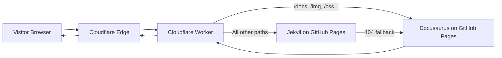

# 🌐 Wechaty.js.org — Cloudflare Worker Transparent Proxy

<p align="center">
<a href="https://github.com/cloudflare/workers">
  
</a>
<a href="https://github.com/wechaty/wechaty.js.org/actions">
  
</a>
<a href="https://github.com/wechaty/wechaty.js.org">
  
</a>
</p>

<div align="center">
<a href="https://wechaty.js.org">
  
</a>
<br/>
<h1>Wechaty Organization Website</h1>
<p>
This repository hosts the official Wechaty website proxy layer — now rebuilt entirely using <b>Cloudflare Workers</b>, replacing the legacy Nginx + Docker Compose setup.
</p>
</div>

<div align="center">
<a href="https://wechaty.js.org">
  
</a>
<br/>
<h1>Wechaty Organization Website</h1>
<p>
This repository hosts the official Wechaty website proxy layer — now rebuilt entirely using **Cloudflare Workers**, replacing the legacy Nginx + Docker Compose setup.
</p>
</div>

This repository contains the **Cloudflare Worker implementation** of the official **Wechaty.js.org transparent proxy**, replacing the legacy Docker + Nginx setup.

The Worker routes traffic from **wechaty.js.org** to two different GitHub Pages sites — **Docusaurus** and **Jekyll** — while preserving original URLs and providing global edge caching.

🔥 Fast.
🔥 Serverless.
🔥 Globally distributed.
🔥 Zero-downtime.

---

## 🚀 Overview

### 📌 What this repo used to do

Historically, `wechaty.js.org` served as a transparent proxy that merged two different GitHub Pages sites:

1. **Jekyll (News, Blog, Contributors)**: [https://github.com/wechaty/jekyll](https://github.com/wechaty/jekyll)
2. **Docusaurus (Documentation)**: [https://github.com/wechaty/docusaurus](https://github.com/wechaty/docusaurus)

The original architecture used:

* Docker Compose
* Nginx reverse proxy
* Automated TLS via nginx-proxy + ACME companion

It looked like this:


### 🚀 What this repo does now

All of the above functionality is now implemented in **one Cloudflare Worker**:

* Same routing logic
* Same fallback behavior
* Same transparent proxying
* No breaking changes to URLs
* **Much faster**, globally distributed, serverless infrastructure

The old configuration files have been preserved in:

```
/deprecated/
```

for historical reference.

The legacy architecture used:

* Docker Compose
* Nginx reverse-proxy
* Automated TLS (nginx-proxy, acme-companion)

That system routed Wechaty website traffic to:

* **Docusaurus** documentation → `https://wechaty.github.io/docusaurus/`
* **Jekyll** news, blogs, contributors → `https://wechaty.github.io/jekyll/`

This repo now contains a **Cloudflare Worker** that implements:

* The same routing logic
* Internal redirect following
* 404 fallback from Jekyll → Docusaurus
* Transparent proxying (no URL changes)
* Edge caching with `stale-while-revalidate`

All old Nginx and Docker configurations have been moved to:

```
/deprecated/
```

for historical reference.

---

## 🧭 Architecture

### 🏛️ Legacy Architecture (Historical)


---

### ⚡ New Cloudflare Worker Architecture (Current)

#### High-level Flow



#### Worker Routing Logic

```mermaid
flowchart TD
    A[Incoming Request] --> B{Starts With<br>/docs, /press,<br>/qrcode, /search,<br>/img, /css, /js?}

    B -->|Yes| C[Docusaurus Path<br>/docusaurus{path}]
    B -->|No| D[Jekyll Path<br>/jekyll{path}]

    D --> E{Status 404?}
    E -->|Yes| C
    E -->|No| F[Return Jekyll Response]

    C --> G[Return Docusaurus Response]
```

#### Edge Caching Layer


### Old Architecture

```
Visitor → Nginx Reverse Proxy → GitHub Pages (Jekyll/Docusaurus)
```

### New Architecture

```
Visitor → Cloudflare → Worker → GitHub Pages (Jekyll/Docusaurus)
```

The Worker runs globally on Cloudflare’s edge, providing built‑in caching, instant deploys, and no server maintenance.

---

## 🔀 Routing Rules

The Worker replicates the original Nginx logic:

### 📘 Docusaurus Routes

Paths beginning with:

```
/docs
/press
/qrcode
/search
/img
/css
/js
```

are proxied to:

```
https://wechaty.github.io/docusaurus{path}
```

### 📝 Jekyll Routes (with fallback)

All other paths:

1. First try → `https://wechaty.github.io/jekyll{path}`
2. If **404**, fallback → `https://wechaty.github.io/docusaurus{path}`

### 🔁 Redirect Following

If upstream returns 301/302/303/307/308, the Worker **internally refetches** and returns the final content, matching Nginx `@handle_redirects`.

---

## ⚡ Cloudflare Worker Code

The Worker is implemented in:

```
src/index.js
```

It includes:

* Routing rules
* Internal redirect loop
* Edge cache write/read
* GitHub Pages origin logic

Key features:

* `caches.default` for edge caching
* `stale-while-revalidate` behavior
* Custom `X-Cache` and `X-Proxy-By` headers

---

## 📦 Deployment (Wrangler)

### 1. Install Wrangler

```bash
npm install -g wrangler
wrangler login
```

### 2. Deploy Worker

```bash
wrangler deploy
```

### 3. Bind Custom Domain

Cloudflare Dashboard → **Workers & Pages → wechaty-proxy → Custom Domains**:

```
wechaty.js.org
```

The Worker now receives all production traffic.

---

## 🗂️ Repository Structure

```
wechaty.js.org/
├─ src/
│  └─ index.js            # Cloudflare Worker code
├─ wrangler.toml          # Worker configuration
├─ deprecated/            # Old Docker + Nginx config files
├─ README.md              # (this file)
└─ ...
```

### `wrangler.toml` Example

```toml
name = "wechaty-proxy"
main = "src/index.js"
compatibility_date = "2025-11-13"

routes = [
  { pattern = "wechaty.js.org/*", custom_domain = true }
]
```

---

## 📊 Observability & Debugging

### Real-time Logs

```bash
wrangler tail wechaty-proxy
```

### Useful Headers

* `X-Cache: HIT/MISS`
* `X-Proxy-By: wechaty.js.org-cloudflare-worker`

### Cloudflare Analytics

Shows global traffic, latency, and cache hit ratios.

---

## 🧠 Design Principles

* Maintain full compatibility with original site routing.
* Minimize latency through global edge execution.
* Keep wechaty.js.org URLs stable — no redirects to GitHub Pages.
* Reduce origin load via aggressive caching.
* Use modern serverless Infrastructure instead of maintaining VMs or containers.

---

## 📚 Historical Reference & History

The entire legacy infrastructure has been preserved for archival purposes under `deprecated/`:

* `nginx.conf`
* `docker-compose.yml`
* TLS automation (ACME companion)

These files document years of Wechaty website operations before migration to Cloudflare.

### 📜 History

#### **Mar 31, 2022 — Split Repo (Jekyll & Docusaurus)**

Tracked via Issue #1: [https://github.com/wechaty/wechaty.js.org/issues/1](https://github.com/wechaty/wechaty.js.org/issues/1)

#### **Nov 2025 — Migration to Cloudflare Workers**

* Replaced Nginx + Docker with a fully serverless, zero-maintenance setup.
* Introduced global edge caching, redirect-following, and routing logic in a single Worker.
* Improved latency worldwide.
* Simplified deployment to a single `wrangler deploy`.

#### **2021–2025 — Wechaty Website Evolution**

* Continuous enhancements to documentation (Docusaurus)
* Growth of the blog and community contributions (Jekyll)
* Stability improvements in serving multi-source content under one domain

The new Worker architecture ensures Wechaty.js.org remains stable, fast, and easy to maintain for future contributors.
All original Docker, Nginx, and TLS configs are preserved under:

```
/deprecated/
```

including:

* `nginx.conf`
* `docker-compose.yml`
* ACME/Let’s Encrypt automation

These can be revisited for migration context or future reference.

---

## 👤 Author

**Huan LI (李卓桓)** — creator of Wechaty, open-source advocate, and cloud architect.

GitHub: [https://github.com/huan](https://github.com/huan)
Website: [https://wechaty.js.org](https://wechaty.js.org)

---

## 📄 License

This project is licensed under the **Apache-2.0 License**.
See `LICENSE` for details.
